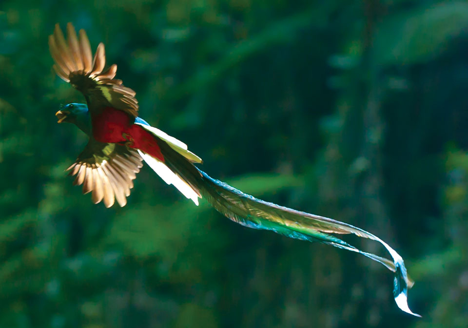

###### JS230 — Front-end Development with JavaScript > Miscellaneous GUI Apps

---

## Exotic Animals

Create a page that displays a grid of animal images and shows a tooltip for each animal that contains more information about the animal.

#### Requirements

- Choose any animals that you want.
- Create markup that includes an image and caption for each animal.
- Hide the captions initially.
- Display the caption as a tooltip when the user hovers the mouse cursor over the image for more than two seconds. Close the tooltip when the user moves the mouse off the image.
- Don't display the caption tooltip when the user moves the cursor off the image before the two second time delay elapses.  

See the [demo app](https://dbdwvr6p7sskw.cloudfront.net/js-exercises/mini_projects/misc_gui_projects/01_exotic_animals_tooltip/index.html) for an example application.  

###### HTML

```html
<!DOCTYPE html>
<html lang="en-US">
  <head>
    <title>Exotic Animals</title>
    <meta charset="UTF-8" />
    <link rel="stylesheet" href="exotic_animals.css" />
    <script src="exotic_animals.js"></script>
  </head>
  <body>
    <h1>Exotic Animals</h1>
    <div id="exotic_animals">
      <figure>
        
        <figcaption>Quetzal are found in forests and woodlands, especially in humid highlands, with the five species from the genus Pharomachrus being exclusively Neotropical, while the single Euptilotis species is found in Mexico and very locally in southern United States.</figcaption>
      </figure>
      <figure>
        
        <figcaption>The blackbuck,  also known as the Indian antelope, is an antelope found in Pakistan, India and Nepal. The blackbuck is the sole extant member of the genus Antilope. The species was described and given its binomial name by Swedish zoologist Carl Linnaeus in 1758.</figcaption>
      </figure>
      <figure>
        
        <figcaption>The golden pheasant or Chinese pheasant (Chrysolophus pictus) is a gamebird of the order Galliformes (gallinaceous birds) and the family Phasianidae (pheasants). It is native to forests in mountainous areas of western China.</figcaption>
      </figure>
      <figure>
        
        <figcaption>The greater bird-of-paradise (Paradisaea apoda) is a bird-of-paradise in the genus Paradisaea. The greater bird-of-paradise is the largest member in the genus Paradisaea, with males measuring up to 43 cm (17 in) (excluding the long twin tail wires). The female is smaller, at only 35 cm (14 in).</figcaption>
      </figure>
      <figure>
        
        <figcaption>The rainbow lorikeet (Trichoglossus moluccanus) is a species of parrot found in Australia. It is common along the eastern seaboard, from northern Queensland to South Australia and Tasmania. Its habitat is rainforest, coastal bush and woodland areas.</figcaption>
      </figure>
      <figure>
        
        <figcaption>The vampire squid is a small, deep-sea cephalopod found throughout the temperate and tropical oceans of the world. Unique retractile sensory filaments justify the vampire squid's placement in its own order: Vampyromorphida.</figcaption>
      </figure>
      <figure>
        
        <figcaption>A genet is a member of the genus Genetta, which consists of 14 to 17 species of small African carnivorans. Genet fossils from the Pliocene have been found in Morocco. The common genet is the only genet present in Europe and occurs in the Iberian Peninsula and France.</figcaption>
      </figure>
      <figure>
        
        <figcaption>The lined butterflyfish is a butterflyfish (family Chaetodontidae), one of the largest species in the genus Chaetodon. They have a wide range from the Red Sea to South Africa and as far east as southern Japan and Hawaii.</figcaption>
      </figure>
    </div>
  </body>
</html>
```

###### CSS

```css
@import url("whitespace-reset.css");

body {
  background: #335;
}

h1 {
  margin-top: 20px;
  margin-bottom: 30px;
  text-align: center;
  color: #fff;
  font-size: 28px;
}

figure {
  width: 22%;
  margin-left: 2%;
  display: inline-block;
  margin-bottom: 20px;
  vertical-align: top;
  padding: 10px;
  box-sizing: border-box;
  background: #fff;
  border-radius: 3px;
  position: relative;
}

figcaption {
  display: none;
  width: 300px;
  padding: 10px;
  height: 150px;
  border-radius: 4px;
  background: rgba(0, 0, 20, 0.7);
  color: #fff;
  z-index: 5;
}

figcaption.show {
  display: inline-block;
  position: absolute;
  margin-left: -90%;
  margin-top: 10%;
}

img {
  width: 100%;
}
```

#### My Solution

###### JavaScript

```javascript
"use strict";

document.addEventListener('DOMContentLoaded', () => {
  let images = document.querySelectorAll('img');

  for (let index = 0; index < images.length; index += 1) {
    images[index].addEventListener('mouseenter', event => {
      let figcaption = event.target.nextElementSibling;

      let mouseLeft = false;

      images[index].addEventListener('mouseleave', event => {
        mouseLeft = true;
      });

      setTimeout(() => {
        if (!mouseLeft) {
          figcaption.classList.add('show');
          images[index].addEventListener('mouseleave', event => {
            figcaption.classList.remove('show');
          });
        }
      }, 2000);
    });
  }
});
```

#### LS Solution

Tooltips are a useful and unobtrusive way to show additional information to the user. The information stays out of the way when not needed and shows up when the user wants it. This exercise provides us with an opportunity to use some browser events, DOM manipulation, and to practice implementing this useful UI element.

